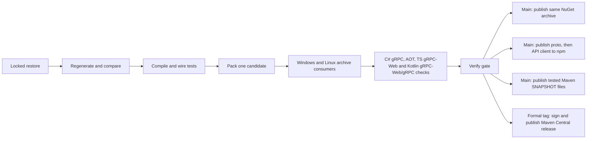

# ArcForges Contracts

[](https://github.com/ArcForges/Contracts/actions/workflows/ci.yml)
[](https://github.com/ArcForges/Contracts/actions/workflows/security.yml)

Handwritten protobuf contracts and generated C#/TypeScript/Java/Kotlin packages for the
ArcForges product family. Consumers install versioned packages; they do not clone
this repository, run protoc, use Git submodules or depend on sibling source.

**Current scope:** one Hello World service and a working generation, packaging and
CI foundation, including Kotlin/JVM for Android. Product APIs and mobile applications are later deliveries.

| Package                                        | Contents                                                                   | Consumer                              |
| ---------------------------------------------- | -------------------------------------------------------------------------- | ------------------------------------- |
| `ArcForges.Contracts.PublicApi`                | Generated C# messages, gRPC client/server bindings, proto and descriptor   | .NET 10                               |
| `@arcforges/proto`                             | ESM JavaScript, TS declarations, messages, service descriptors and proto   | Web contract types                    |
| `@arcforges/api-client`                        | Typed Hello client using gRPC-Web                                          | Browser-compatible fetch environments |
| `io.github.arcforges:contracts-proto`          | Java/Kotlin lite messages, schema and descriptor                           | Android/JVM                           |
| `io.github.arcforges:contracts-client`         | Java-lite gRPC bindings and Kotlin coroutine stubs                         | Android/JVM                           |
| `io.github.arcforges:contracts-connect-client` | Generated Connect-Kotlin coroutine client; caller selects gRPC-Web or gRPC | Android/JVM                           |
| `io.github.arcforges:contract-fixtures`        | Shared wire fixtures and Java resource accessor                            | Consumer tests                        |

Android uses the Kotlin/JVM artifacts: `contracts-connect-client` supports the
current Worker gRPC-Web ingress; `contracts-client` retains native grpc-kotlin.
Web uses the TypeScript artifacts and gRPC-Web. All share the same handwritten proto; consumers need no
compiler or source checkout. Kotlin/Native and iOS are outside this delivery.

## Local quick start

Install .NET SDK **10.0.400**, Node **24.21.0** (npm **11.19.0**) and Python
**3.14.7**, JDK **17** and GnuPG (for the ephemeral signing test). Set `JAVA_HOME`
to JDK 17. The checksum-pinned Gradle **9.7.1** wrapper is included; do not install
a separate Gradle. Kotlin **2.4.20** is pinned in the version catalog. Version files in the root are authoritative. On Windows with fnm,
select the pinned Node using `fnm use 24.21.0`; `fnm exec --using 24.21.0 --
python eng/contracts.py restore` is an alternative if the shell is not configured.

From this repository:

```text
python eng/contracts.py restore
python eng/contracts.py generate --check
python eng/contracts.py pack
python -m unittest discover -s tests/tooling -v
python eng/contracts.py consume --aot
```

The producer currently runs on x64 Windows/Linux; the same generated packages
are managed artifacts without native RID assets. The isolated AOT consumer needs
the .NET Native AOT C++ prerequisites: Visual Studio C++ build tools/Windows SDK
on Windows, or clang and zlib development headers on Linux.

- Open `ArcForges.Contracts.slnx` in a compatible .NET IDE.
- Edit `public/proto/arcforges/hello/v1/hello.proto`, then run
  `python eng/contracts.py generate`. Commit generated C#, TS, Java and Kotlin changes.
- Use `python eng/contracts.py restore --update-locks` after an intentional
  dependency change; also run `python eng/contracts.py consume --update-kotlin-locks`
  after packing to update the isolated Kotlin consumer locks/checksums. Ordinary
  development/CI uses strict Gradle locks and checksum verification.
- `python eng/contracts.py verify-local` runs locked restore, generation checks,
  build, wire tests and formatting without producing archives.
- `npm run format` formats authored JSON/YAML/Markdown/TS. Generated output is
  compared against protoc output instead.

The local candidate version is `1.0.0-ci.0.0`. Pack creates one `.nupkg`, two
`.tgz` archives, a Maven repository ZIP containing four modules, `contracts.binpb`
and a hash manifest in `artifacts/packages`.
Each package carries its licence, dependency NOTICE, CycloneDX SBOM and source
metadata. Consumer evidence is written to `artifacts/evidence`.

## CI and automatic publication



PRs and diagnostic manual runs validate only. Main pushes allocate
`1.0.0-ci.<run-number>.<run-attempt>` automatically. There is no manual version
form or manual publishing command in the normal release flow. Before the first stable tag, newer npm CI releases update `latest`. Afterwards, development builds use `ci` and stable releases own `latest`. These remain prereleases; consumers pin the exact verified
version. Generated schemas use wire namespace
`v1`, which is independent of the increasing package build version.

**Registry setup is required once.** An unset/disabled publisher produces a
visible skipped registry job. A green `Verify` means the candidate passed, not
that it was uploaded. Follow [the complete account-to-release setup](docs/releasing.md)
for NuGet/npm OIDC and Maven Central account/signing configuration. Each registry
has a separate GitHub environment restricted to main and release tags; these are repository settings, not
organisation-wide environments.

## Product naming policy

WP00.00 adds the single machine-readable naming authority in
[eng/policy/product-names.json](eng/policy/product-names.json) and a portable
Git inventory check. This is policy tooling; published Hello contracts and package
identities are unchanged. It records three desktop products, the companion wire
identity and the embedded assistant feature. Native file associations are reserved,
not implemented handlers.

```text
python eng/check_naming.py --report artifacts/evidence/naming.json
python -m unittest discover -s tests/tooling -p test_naming_policy.py -v
```

Use repeated `--repository OWNER=PATH` arguments to inventory separate checkouts
without adding a product build dependency. Only exact hash-bound provenance records
may use reference names; source, generated code, resources and implementation notes
are all scanned. See [scope and evidence](docs/implementation/wp00-00-naming.md).

WP00.01 adds one digest-bound registration for DesktopPlatform's generated glossary
forbidden-alias declaration. Its closed envelope and immutable Design source identity
must match before those declaration values are admitted; every other field remains
scanned. The AGPL exporter and data stay in DesktopPlatform. See
[derived declaration verification](docs/implementation/wp00-01-derived-policy.md).

WP00.03 records current wrappers, generated bindings and retained legal text in
`eng/provenance/`. Run `python eng/check_provenance.py --owner Contracts` before
packing or proposing reuse. The [provenance process](docs/implementation/wp00-03-provenance.md)
defines review responsibility, immutable records, inventory and notice checks.

## Examples and project policies

Every managed, npm and Gradle project declares both SPDX and licence-boundary
metadata. The Git inventory gate runs before the producer build; MSBuild and
Gradle reject incompatible effective properties and project references during
execution. Run `python eng/check_licences.py` and see
[WP00.02 checks and evidence](docs/implementation/wp00-02-licence-boundary.md).

- [Consumer installation and Hello examples](docs/consuming.md)
- [Boundaries, generation and package layout](docs/architecture.md)
- [Bootstrap plan and acceptance](docs/bootstrap-plan.md)
- [Kotlin implementation plan](docs/kotlin-artifacts-plan.md)
- [Kotlin gRPC-Web extension plan](docs/kotlin-grpc-web-plan.md)
- [Validation evidence and limits](docs/validation.md)
- [Contributing](CONTRIBUTING.md), [security reporting](SECURITY.md) and
  [code of conduct](CODE_OF_CONDUCT.md)

ArcForges-authored content throughout this repository and its published packages
uses [Apache-2.0](LICENSE), including schemas, generated bindings, client code,
examples and tooling. See [licensing details](docs/architecture.md#licensing).
Dependencies retain their own licences. No product implementation or
reference-repository source is bundled.

[WP01.01 contract access assignment](docs/implementation/wp01-01-contract-access.md)
records every current contract/distribution type and rejects public-to-internal dependencies
using compiled proto descriptors before candidate packing.

## Publication channels

Main Maven builds publish `1.0.0-SNAPSHOT`; NuGet/npm retain their CI build versions. Canonical `vX.Y.Z` tags on main ancestry publish formal `X.Y.Z` packages after the same tests. Existing consumer pins remain immutable. See [snapshot setup, identity and ten-minute recovery](docs/maven-central.md).
