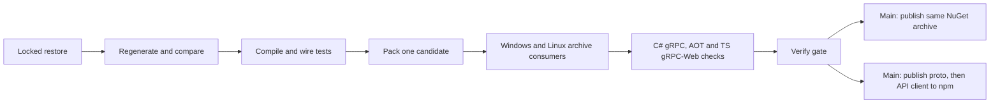

# ArcForges Contracts

[](https://github.com/ArcForges/Contracts/actions/workflows/ci.yml)
[](https://github.com/ArcForges/Contracts/actions/workflows/security.yml)

Handwritten protobuf contracts and generated C#/TypeScript packages for the
ArcForges product family. Consumers install versioned packages; they do not clone
this repository, run protoc, use Git submodules or depend on sibling source.

**Current scope:** one Hello World service and a working generation, packaging and
CI foundation. Product APIs and the React Native transport are later deliveries.

| Package                         | Contents                                                                 | Consumer                              |
| ------------------------------- | ------------------------------------------------------------------------ | ------------------------------------- |
| `ArcForges.Contracts.PublicApi` | Generated C# messages, gRPC client/server bindings, proto and descriptor | .NET 10                               |
| `@arcforges/proto`              | ESM JavaScript, TS declarations, messages, service descriptors and proto | Shared Web/RN contract types          |
| `@arcforges/api-client`         | Typed Hello client using gRPC-Web                                        | Browser-compatible fetch environments |

The TS proto package has no Node or DOM imports. RN shares these types; its
Hermes-compatible networking adapter belongs in the future
`@arcforges/rn-transport` package. A Node gRPC-Web test does not certify a browser
or a React Native device.

## Local quick start

Install .NET SDK **10.0.400**, Node **24.21.0** (npm **11.19.0**) and Python
**3.14.7**. Version files in the root are authoritative. On Windows with fnm,
select the pinned Node using `fnm use 24.21.0`; `fnm exec --using 24.21.0 --
python eng/contracts.py restore` is an alternative if the shell is not configured.

From this repository:

```text
python eng/contracts.py restore
python eng/contracts.py generate --check
python eng/contracts.py pack
python -m unittest discover -s tests/tooling -v
python eng/contracts.py consume --aot
```

The producer currently runs on x64 Windows/Linux; the same generated packages
are managed artifacts without native RID assets. The isolated AOT consumer needs
the .NET Native AOT C++ prerequisites: Visual Studio C++ build tools/Windows SDK
on Windows, or clang and zlib development headers on Linux.

- Open `ArcForges.Contracts.slnx` in a compatible .NET IDE.
- Edit `public/proto/arcforges/hello/v1/hello.proto`, then run
  `python eng/contracts.py generate`. Commit the generated C# and TS changes.
- Use `python eng/contracts.py restore --update-locks` after an intentional
  dependency change; ordinary development/CI uses locked restore.
- `python eng/contracts.py verify-local` runs locked restore, generation checks,
  build, wire tests and formatting without producing archives.
- `npm run format` formats authored JSON/YAML/Markdown/TS. Generated output is
  compared against protoc output instead.

The local candidate version is `1.0.0-ci.0.0`. Pack creates one `.nupkg`, two
`.tgz` archives, `contracts.binpb` and a hash manifest in `artifacts/packages`.
Each package carries its licence, dependency NOTICE, CycloneDX SBOM and source
metadata. Consumer evidence is written to `artifacts/evidence`.

## CI and automatic publication



PRs and diagnostic manual runs validate only. Main pushes allocate
`1.0.0-ci.<run-number>.<run-attempt>` automatically. There is no manual version
form or manual publishing command in the normal release flow. New npm releases
update `latest`, so the default package page and fresh installs select the newest
published CI version. These remain prereleases; consumers pin the exact verified
version. Generated schemas use wire namespace
`v1`, which is independent of the increasing package build version.

**Registry setup is required once.** An unset/disabled publisher produces a
visible skipped registry job. A green `Verify` means the candidate passed, not
that it was uploaded. Follow [the complete account-to-release setup](docs/releasing.md)
for NuGet OIDC and the npm initial CI bootstrap followed by OIDC.

## Examples and project policies

- [Consumer installation and Hello examples](docs/consuming.md)
- [Boundaries, generation and package layout](docs/architecture.md)
- [Bootstrap plan and acceptance](docs/bootstrap-plan.md)
- [Validation evidence and limits](docs/validation.md)
- [Contributing](CONTRIBUTING.md), [security reporting](SECURITY.md) and
  [code of conduct](CODE_OF_CONDUCT.md)

ArcForges-authored content throughout this repository and its published packages
uses [Apache-2.0](LICENSE), including schemas, generated bindings, client code,
examples and tooling. See [licensing details](docs/architecture.md#licensing).
Dependencies retain their own licences. No product implementation or
reference-repository source is bundled.
