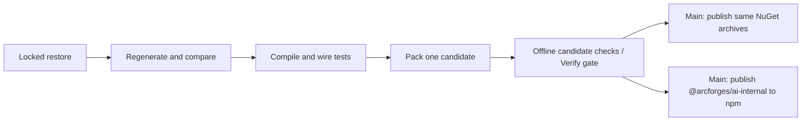

# ArcForges Contracts

[](https://github.com/ArcForges/Contracts/actions/workflows/ci.yml)
[](https://github.com/ArcForges/Contracts/actions/workflows/security.yml)

Handwritten protobuf contracts and generated C# packages for the ArcForges product
family, plus one internal thin-adapter npm package, `@arcforges/ai-internal`. C# NuGet
is the only first-party SDK channel for business clients (CON.40, P2-021 Decision 4).
Consumers install versioned packages; they do not clone this repository, run protoc,
use Git submodules or depend on sibling source.

**Current scope:** WP03.00–WP03.02 are accepted. WP03.00 establishes source-bearing
contract boundaries with selected complete Foundation/error, event, private product/helper,
operator and extension records, HTTP definitions, validators and an offline inventory CLI;
[WP03.01](docs/wp03-01-foundation.md) adds the foundation value records and
[WP03.02](docs/wp03-02-serialization.md) the generated-only serialization posture. Hello
compatibility remains. Capability and resource descriptors (WP03.03), the complete business
operation registries and the package-level gates are open delivery tasks in the
[contracts lane](https://github.com/ArcForges/ArcForges-Design-B/blob/f8dff2d0144c7db020d35711d606334639dd078b/docs/planning/delivery/lanes/contracts.md). The exact producer inventory is
[`eng/contract-packages.json`](eng/contract-packages.json).

| Package family                                                           | Contents                                                                                          |
| ------------------------------------------------------------------------ | ------------------------------------------------------------------------------------------------- |
| `ArcForges.Contracts.Foundation`, `.PublicApi`, `.Events`, `.Validation` | Shared wire records, retained Hello and public HTTP definitions, event hints and shape validators |
| `ArcForges.Contracts.LocalRpc.Platform`, `.Sandbox`, `.Chat`, `.Scope`   | Private helper and in-process product result records; no product listener                         |
| `ArcForges.Contracts.CloudInternal`                                      | Private HTTP and separately partitioned operator records                                          |
| `ArcForges.Sdk.Contracts`, `ArcForges.Sdk.Client`, `ArcForges.Cli`       | Public extension protocol, caller-owned transport composition and offline inventory validation    |
| `@arcforges/ai-internal`                                                 | Internal AI/Cloud HTTP schema records and validators for the Cloudflare thin adapters             |

Business clients use the C# packages, with binary gRPC-Web for public business
ingress. `@arcforges/ai-internal` is published to the public npm registry
(`publishConfig` access `public`), but its contract access is `internal`: registry
visibility does not change the import boundary, and public clients must not import
it. Extension IPC bindings are C# SDK-only. Internal packages remain Apache-2.0 but
are excluded from public client imports. Kotlin/Native and iOS are outside this
delivery.

**Retired package identities (CON.40).** No new version of npm `@arcforges/proto`,
`@arcforges/api-client`, `@arcforges/contract-fixtures` or `@arcforges/operator-client`,
or of Maven `io.github.arcforges:contracts-proto`, `contracts-connect-client` or
`contract-fixtures`, is generated, built, packed or published from main. Their rows stay
in [`eng/contract-packages.json`](eng/contract-packages.json) marked `retired`, and their
TypeScript and Kotlin sources and generators are removed. Already published versions
stay immutable and resolvable: nothing is unpublished, deprecated or deleted, and
existing exact consumer pins keep working. The native-grpc-only `contracts-client`
was retired from new publications at WP03.00 in the same way.

## Local quick start

Install .NET SDK **10.0.400**, Node **24.21.0** (npm **11.19.0**) and Python
**3.14.7**. Reuse the installed tools. No JDK, Gradle or Kotlin toolchain is needed:
the Kotlin and Maven channel is retired (CON.40). Version files in the root are authoritative. On Windows with fnm,
select the pinned Node using `fnm use 24.21.0`; `fnm exec --using 24.21.0 --
python eng/contracts.py restore` is an alternative if the shell is not configured.

From this repository:

```text
python eng/contracts.py restore
python eng/contracts.py generate --check
python eng/contracts.py pack
python -m unittest discover -s tests/tooling -v
```

The producer currently runs on x64 Windows/Linux; the same generated packages
are managed artifacts without native RID assets. The isolated AOT consumer needs
the .NET Native AOT C++ prerequisites: Visual Studio C++ build tools/Windows SDK
on Windows, or clang and zlib development headers on Linux.

- Open `ArcForges.Contracts.slnx` in a compatible .NET IDE.
- Edit `public/proto/arcforges/hello/v1/hello.proto`, then run
  `python eng/contracts.py generate`. Commit the generated C# changes and any
  `@arcforges/ai-internal` TypeScript changes.
- Use `python eng/contracts.py restore --update-locks` after an intentional
  dependency change; update any affected retained local consumer locks only when that diagnostic is required. Ordinary
  development/CI restores npm (`npm ci`) and NuGet (`--locked-mode`) from the committed locks.
- `python eng/contracts.py verify-local` runs locked restore, generation checks,
  build, wire tests and formatting without producing archives.
- `npm run format` formats authored JSON/YAML/Markdown/TS. Generated output is
  compared against protoc output instead.

The local candidate version is `1.0.0-ci.0.0`. Pack creates twelve `.nupkg` archives,
one `.tgz` archive (`@arcforges/ai-internal`), the per-package descriptor sets
(`*.binpb`, including `contracts.binpb`) and a hash manifest in `artifacts/packages`.
Each package carries its licence, dependency NOTICE, CycloneDX SBOM and source
metadata. Runtime consumers are explicit local opt-in (`python eng/contracts.py consume --aot`)
only for affected behavior and reject CI execution. They are not publication prerequisites.
Real transport/signing fixtures additionally require `ARCFORGES_LOCAL_INTEGRATION=1` outside CI;
do not install tools or repeat passing checks just to expand validation.

## CI and automatic publication


```mermaid
flowchart LR
  A[Locked restore] --> B[Regenerate and compare]
  B --> C[Compile and wire tests]
  C --> D[Pack one candidate]
  D --> G[Offline candidate checks / Verify gate]
  G --> H[Main: publish same NuGet archives]
  G --> I[Main: publish @arcforges/ai-internal to npm]
```

PRs and diagnostic manual runs validate only. Main pushes allocate
`1.0.0-ci.<run-number>.<run-attempt>` automatically. There is no manual version
form or manual publishing command in the normal release flow. Before the first stable tag, newer npm CI releases update `latest`. Afterwards, development builds use `ci` and stable releases own `latest`. These remain prereleases; consumers pin the exact verified
version. Generated schemas use wire namespace
`v1`, which is independent of the increasing package build version.

**Registry setup is required once.** An unset/disabled publisher produces a
visible skipped registry job. A green `Verify` means the candidate passed, not
that it was uploaded. Follow [the complete account-to-release setup](docs/releasing.md)
for NuGet and npm OIDC configuration. Each registry
has a separate GitHub environment restricted to main and release tags; these are repository settings, not
organisation-wide environments.

No macOS or runtime-consumer CI is permitted. Publication completes at successful registry
operations/status; no public artifact download, hash audit or runtime cycle follows merge.
See [AGENTS.md](AGENTS.md) for the reduced validation policy.

## Product naming policy

WP00.00 adds the single machine-readable naming authority in
[eng/policy/product-names.json](eng/policy/product-names.json) and a portable
Git inventory check. This is policy tooling; published Hello contracts and package
identities are unchanged. It records three desktop products, the companion wire
identity and the embedded assistant feature. Native file associations are reserved,
not implemented handlers.

```text
python eng/check_naming.py --report artifacts/evidence/naming.json
python -m unittest discover -s tests/tooling -p test_naming_policy.py -v
```

Use repeated `--repository OWNER=PATH` arguments to inventory separate checkouts
without adding a product build dependency. Only exact hash-bound provenance records
may use reference names; source, generated code, resources and implementation notes
are all scanned. See [scope and evidence](docs/implementation/wp00-00-naming.md).

WP00.01 adds one digest-bound registration for DesktopPlatform's generated glossary
forbidden-alias declaration. Its closed envelope and immutable Design source identity
must match before those declaration values are admitted; every other field remains
scanned. The AGPL exporter and data stay in DesktopPlatform. See
[derived declaration verification](docs/implementation/wp00-01-derived-policy.md).

WP00.03 records current wrappers, generated bindings and retained legal text in
`eng/provenance/`. Run `python eng/check_provenance.py --owner Contracts` before
packing or proposing reuse. The [provenance process](docs/implementation/wp00-03-provenance.md)
defines review responsibility, immutable records, inventory and notice checks.

## Examples and project policies

Every managed and npm project declares both SPDX and licence-boundary
metadata. The Git inventory gate runs before the producer build; MSBuild rejects
incompatible effective properties and project references during execution. Run `python eng/check_licences.py` and see
[WP00.02 checks and evidence](docs/implementation/wp00-02-licence-boundary.md).

- [Consumer installation and Hello examples](docs/consuming.md)
- [Boundaries, generation and package layout](docs/architecture.md)
- [Bootstrap plan and acceptance](docs/bootstrap-plan.md)
- Retired, historical: [Kotlin implementation plan](docs/kotlin-artifacts-plan.md),
  [Kotlin gRPC-Web extension plan](docs/kotlin-grpc-web-plan.md) and
  [Maven channel](docs/maven-central.md)
- [Validation evidence and limits](docs/validation.md)
- [Contributing](CONTRIBUTING.md), [security reporting](SECURITY.md) and
  [code of conduct](CODE_OF_CONDUCT.md)

ArcForges-authored content throughout this repository and its published packages
uses [Apache-2.0](LICENSE), including schemas, generated bindings, client code,
examples and tooling. See [licensing details](docs/architecture.md#licensing).
Dependencies retain their own licences. No product implementation or
reference-repository source is bundled.

[WP01.01 contract access assignment](docs/implementation/wp01-01-contract-access.md)
records every current contract/distribution type and rejects public-to-internal dependencies
using compiled proto descriptors before candidate packing.

## Publication channels

The active channels are NuGet (the twelve C# packages) and npm (`@arcforges/ai-internal`
only). Main builds publish both at their CI build version. Canonical `vX.Y.Z` tags on
main ancestry publish formal `X.Y.Z` packages of the same identities after the same
tests. The Maven channel (main `1.0.0-SNAPSHOT` and formal Maven Central releases) and
the four first-party npm SDK packages are retired (CON.40): no new version is built or
published, and existing consumer pins remain immutable. See
[registry setup and automatic releases](docs/releasing.md).
